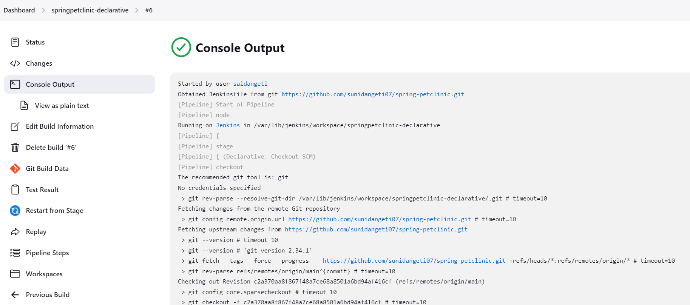
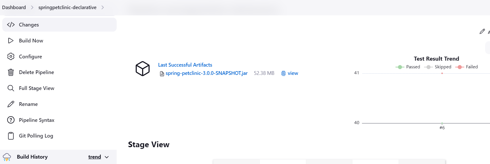
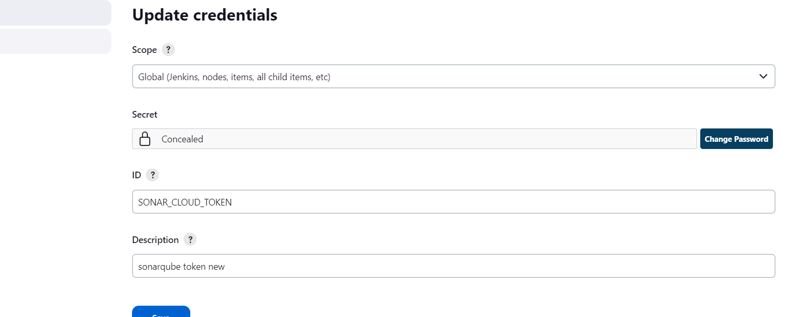
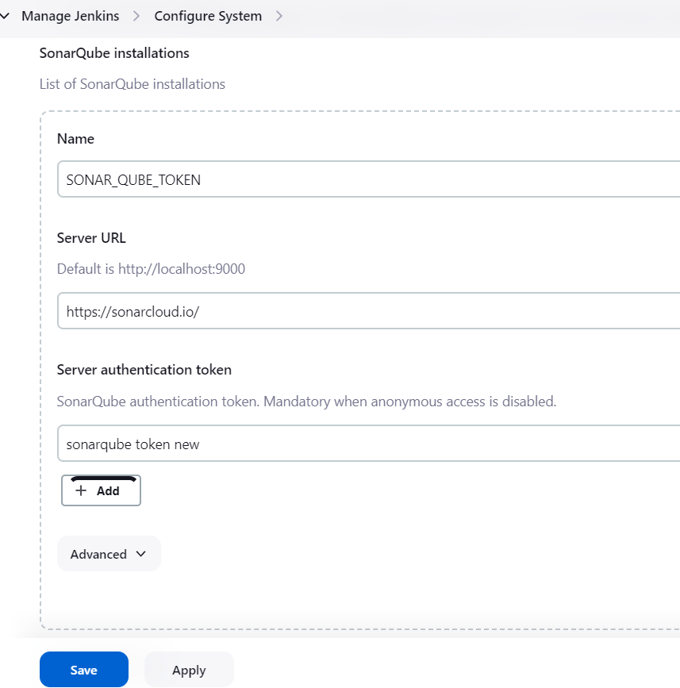
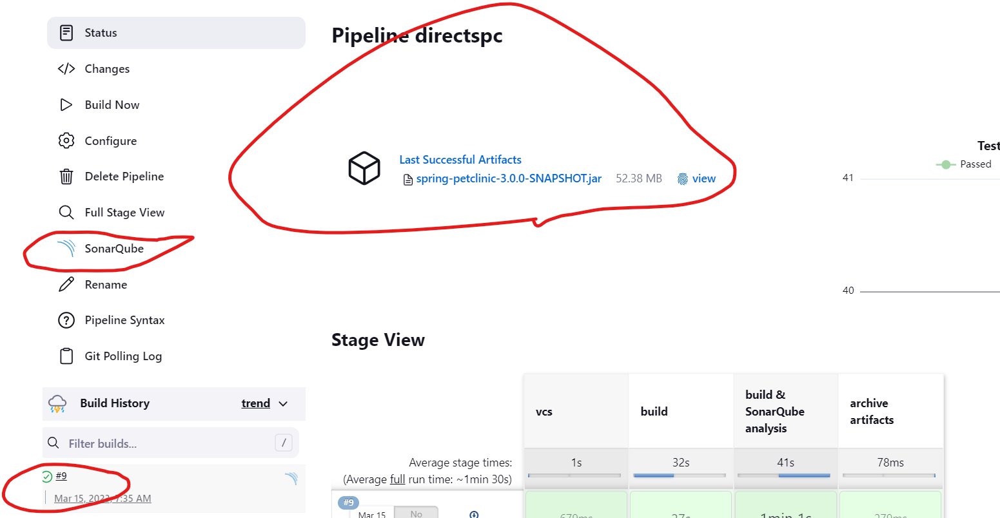

Deploying spring-petclinic
---------------------------
* To run jenkins we need java.
[refer here](https://www.jenkins.io/doc/book/installing/linux/) for long term jenkins installations.
CICD pipeline for deploying the spc
```
pipeline{
    agent{ label 'sai_1' }
    trigger { pollSCM (' * * * * *' )}
    stages{
        stage('vcs'){
            steps{
                git url: 'https://github.com/sunidangeti07/spring-petclinic.git',
                    branch: 'main'
            }
        }
        stage('build'){
            steps{
                sh 'mvn package'
            }
        }
    }
}
---

* the below image is about the pipeline in jenkins

* for publish the artifacts in jenkins console

* we are confugire the maven credentials with the jenkins.

* now configure maven to system.

* the build and the sonatqube scans was successed.

